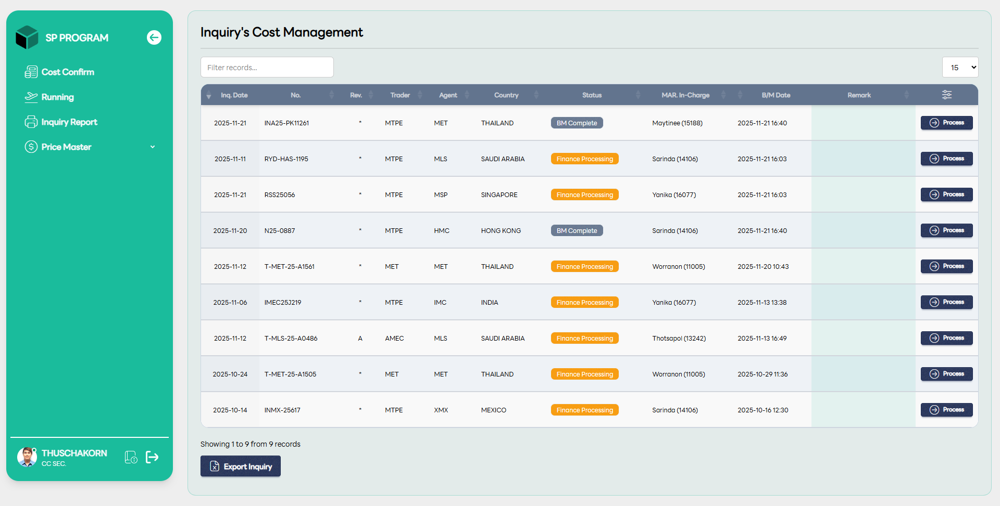
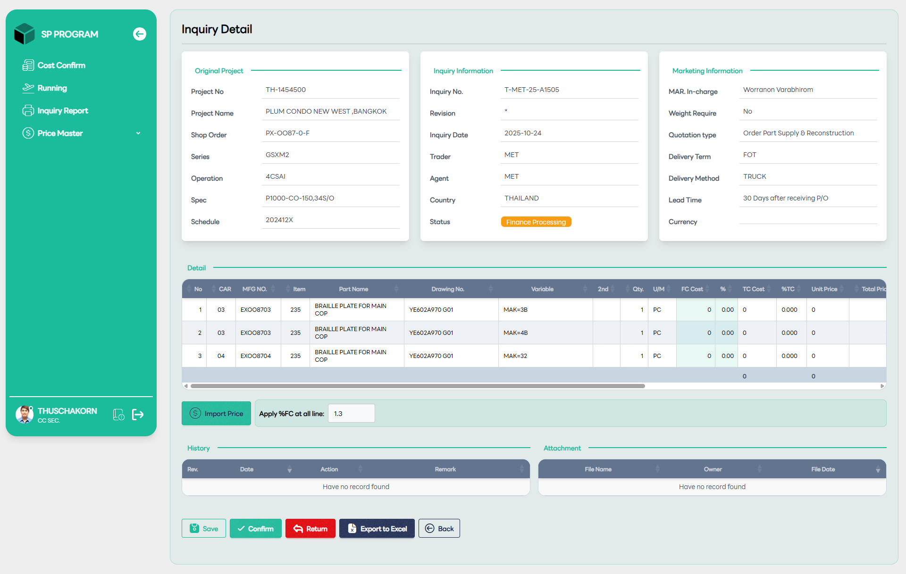

# Price Confirmation

::: info 🎯
สำหรับผู้ใช้งานแผนกการเงิน (Finance User) หน้าจอในส่วนของ Cost Management จะเป็นเครื่องมือหลักในการจัดการต้นทุนเพื่อเตรียมข้อมูลราคาให้ MAR นำไปเสนอราคาต่อลูกค้า โดยมีขั้นตอนการทำงานหลักดังนี้:
:::

## 💰 หน้าจอ Inquiry's Cost Management (หน้ารวมรายการ)

หน้านี้คือ Dashboard สำหรับตรวจสอบรายการที่รอการใส่ราคา:

- การคัดกรองข้อมูล: ใช้ช่อง Filter records เพื่อหาเลขที่ใบงาน (Inquiry No.) หรือชื่อโปรเจกต์ที่ต้องการ

- การตรวจสอบสถานะ: ติดตามรายการที่มีสถานะเป็น "Finance Processing" (สีส้ม) หรือ "BM Complete" (สีเทา) ซึ่งเป็นคิวงานที่ฝ่ายการเงินต้องดำเนินการต่อ

- การเข้าสู่หน้าจัดการราคา: เมื่อเลือกรายการได้แล้ว ให้คลิกปุ่ม "Process" ที่ด้านขวาสุดเพื่อเข้าสู่หน้าจอการใส่รายละเอียดต้นทุน

## 📑 หน้าจอ Inquiry Detail (หน้าบันทึกราคาและต้นทุน)

เมื่อเข้ามาในหน้ารายละเอียด ฝ่ายการเงินจะทำหน้าที่ตรวจสอบข้อมูลโครงการและใส่ราคาในส่วนของ Detail ดังนี้:

### 1. การใส่ข้อมูลต้นทุน (Pricing Entry)

ในตารางรายการชิ้นส่วน ฝ่ายการเงินจะต้องระบุข้อมูลสำคัญในคอลัมน์:

**- FC Cost:** ต้นทุนคงที่ หรือต้นทุนจากโรงงาน (Factory Cost)

**- %:** สัดส่วนเปอร์เซ็นต์กำไรหรือค่าดำเนินการ

**- TC Cost / TC Base:** คำนวณเป็นต้นทุนรวม

**- Unit Price:** ราคาต่อหน่วยที่จะให้ฝ่ายการตลาดนำไปเสนอขาย

### 2. เครื่องมือช่วยคำนวณราคา (Automation Tools)

**- Import Price:** ปุ่มสำหรับดึงข้อมูลราคามาตรฐานจากระบบมาลงในรายการ

**- Apply %FC at all line:** สามารถระบุเปอร์เซ็นต์กำไรที่ต้องการเพียงครั้งเดียวเพื่อให้ระบบคำนวณราคาให้ทุกรายการโดยอัตโนมัติ (เช่น ใส่ค่า 1.3 เพื่อคูณส่วนเพิ่ม 30%)

### 3. การดำเนินการสุดท้าย (Action Buttons)

หลังจากตรวจสอบราคาจนถูกต้องแล้ว ฝ่ายการเงินมีทางเลือกดำเนินการ 4 อย่าง:

**- Save:** บันทึกข้อมูลไว้ก่อนเพื่อกลับมาแก้ไขภายหลัง

**- Confirm:** ยืนยันราคาและส่งงานต่อไปยังฝ่ายการตลาด (MAR User) เพื่อออกใบเสนอราคา

**- Return:** ส่งงานกลับไปยังแผนกก่อนหน้าหากพบว่าข้อมูลเทคนิคหรือจำนวนไม่ถูกต้อง

**- Export to Excel:** ดึงข้อมูลราคาที่กรอกไว้มาตรวจสอบในรูปแบบไฟล์ Excel
