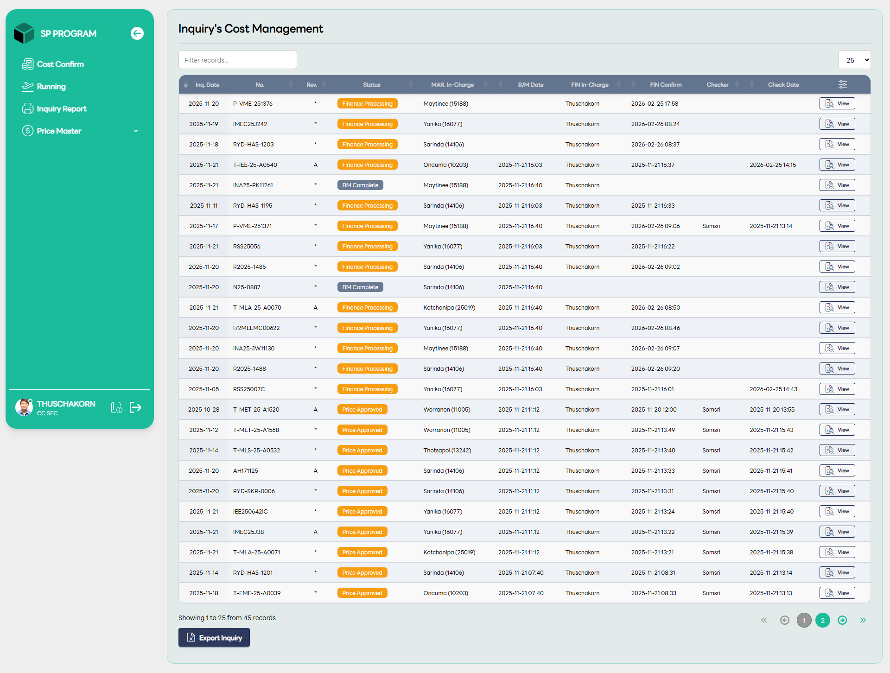

# Price Confirmation

::: info 🎯
หน้าจอ "Runing Inquiry" เป็นศูนย์กลางการติดตามงานสำหรับแผนกการเงิน (Finance) โดยเฉพาะ ซึ่งถูกออกแบบมาเพื่อจัดการและตรวจสอบรายการที่อยู่ในกระบวนการกำหนดต้นทุน (Costing) อย่างละเอียดเพื่อให้มั่นใจว่าราคาก่อนส่งถึงมือ MAR User มีความถูกต้องแม่นยำที่สุด
:::

## 🔍 การทำงานของระบบ Filter และการติดตามสถานะ

หน้าจอนี้จะคัดกรองรายการที่มีสถานะเกี่ยวข้องกับฝ่ายการเงินโดยเฉพาะ เพื่อให้ผู้ใช้สามารถติดตามความคืบหน้าของแต่ละใบงานได้ตามบทบาทหน้าที่ ดังนี้:

### 1. การติดตามตามบทบาท (Roles & Responsibilities)

ตารางจะแสดงชื่อผู้รับผิดชอบในแต่ละขั้นตอนอย่างชัดเจนเพื่อให้ตามงานได้ถูกคน:

**- FIN In-charge:** แสดงชื่อเจ้าหน้าที่การเงินผู้มีหน้าที่ใส่ต้นทุน (FC Cost) ในเบื้องต้น

**- Checker:** แสดงชื่อผู้ตรวจสอบราคา (เช่น หัวหน้างาน หรือผู้เชี่ยวชาญ) ที่มีหน้าที่ Re-check ความถูกต้องของต้นทุนและเปอร์เซ็นต์กำไรอีกครั้ง

### 2. สถานะที่ปรากฏในหน้า Running

รายการที่ปรากฏในหน้านี้จะครอบคลุมขั้นตอนสำคัญ ดังนี้:

**- Finance Processing:** รายการที่เจ้าหน้าที่ (FIN In-charge) กำลังคำนวณต้นทุนหรือใส่ราคาในหน้า Detail

**- BM Complete:** รายการที่ผ่านการคำนวณวัสดุเสร็จสิ้นแล้ว และกำลังจ่อคิวรอให้ฝ่ายการเงินเข้าไปดำเนินการ

**- Price Approved:** รายการที่ผ่านการตรวจสอบและอนุมัติราคาเรียบร้อยแล้ว พร้อมที่จะส่งต่อให้ฝ่ายการตลาดนำไปเสนอราคาต่อไป

## 📊 ส่วนประกอบที่ช่วยเพิ่มประสิทธิภาพการทำงาน

หน้าจอนี้มีคอลัมน์พิเศษที่แตกต่างจากหน้า On-Process ทั่วไป เพื่อให้ฝ่ายการเงินทำงานได้ง่ายขึ้น:

**- FIN Confirm & Check Date:** ระบบจะบันทึก "เวลาที่ยืนยันราคา" และ "วันที่ตรวจสอบ" ไว้อย่างชัดเจน ช่วยให้ทราบว่างานค้างอยู่ที่ใครและใช้เวลาในแต่ละจุดนานเท่าใด

**- B/M Date:** แสดงวันที่ที่ฝ่ายเทคนิคทำ BOM เสร็จ เพื่อให้ฝ่ายการเงินรู้ว่างานนี้ส่งต่อมาถึงตนเองตั้งแต่เมื่อไหร่

**-ปุ่ม View:** ในหน้านี้จะมีเพียงปุ่มสำหรับ "ดูข้อมูล" (View) เพื่อการติดตามสถานะเป็นหลัก หากต้องการแก้ไขราคาต้องไปดำเนินการในส่วนของหน้าจัดการต้นทุนโดยเฉพาะ

## 💡 ประโยชน์ต่อการทำงาน

- การที่หน้าจอนี้รวมทั้งรายการที่ "กำลังทำ", "รอตรวจ", และ "รออนุมัติ" ไว้ในที่เดียว ช่วยให้:

- ไม่ตกหล่น: เห็นภาพรวมของงานทั้งหมดที่อยู่ในความดูแลของแผนกการเงิน

- ตรวจสอบความคืบหน้า: MAR User หรือหัวหน้างานสามารถเข้ามาดูได้ทันทีว่า Inquiry นั้นๆ ติดอยู่ที่ขั้นตอนการใส่ราคา หรือขั้นตอนการตรวจราคา

- วิเคราะห์ข้อมูล: สามารถกด Export Inquiry เพื่อนำข้อมูลระยะเวลาการทำงาน (Lead Time) ในส่วนของ Finance ไปวิเคราะห์เพื่อปรับปรุงกระบวนการทำงานได้ครับ
