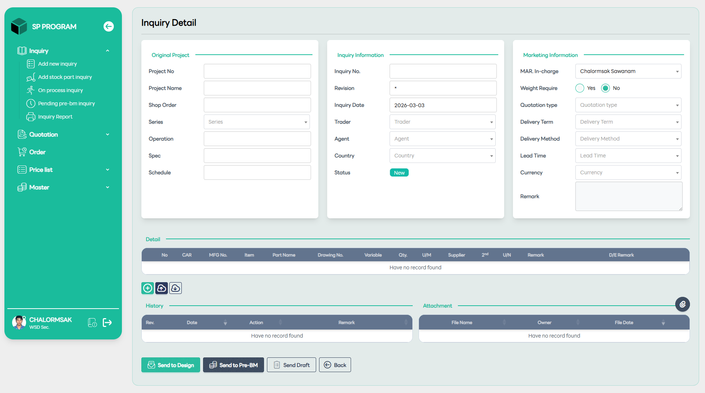
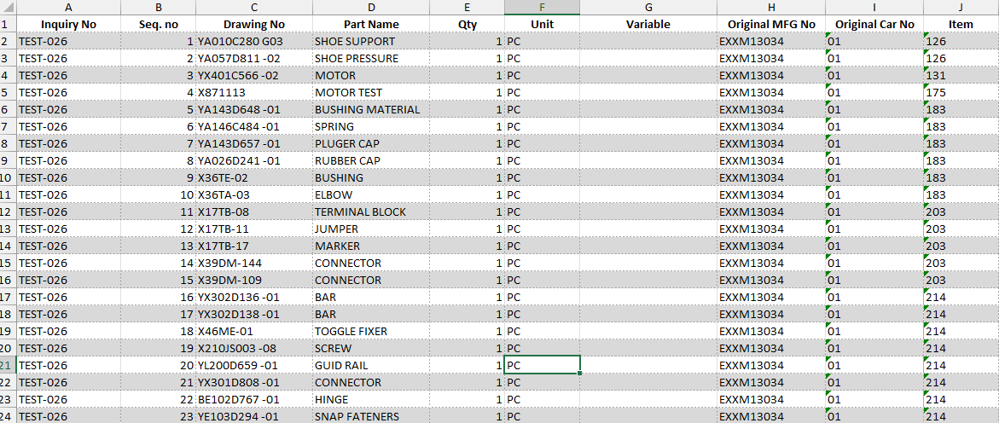

# Create New Inquiry

::: info 🎯
หน้านี้เป็นจุดเริ่มต้นของกระบวนการทำงาน (Workflow) เพื่อรวบรวมความต้องการจากลูกค้าหรือฝ่ายขาย ก่อนจะส่งต่อไปยังแผนกเทคนิค (Design/Pre-BM) เพื่อดำเนินการในขั้นตอนต่อไป
:::

คู่มือนี้จะช่วยให้คุณบันทึกข้อมูล Inquiry ใหม่เข้าสู่ระบบ SP PROGRAM ได้อย่างถูกต้องตามขั้นตอน

## 🛠 ขั้นตอนที่ 1: การระบุข้อมูลโครงการ (Header Input)

ให้เริ่มกรอกข้อมูลจากส่วนบนสุด โดยแบ่งเป็น 3 ส่วนสำคัญ:

**1. Original Project:** ใส่เลขที่โครงการ (Project No) และชื่อโครงการ เพื่อเชื่อมโยงกับฐานข้อมูลหลัก หากมีเลข Shop Order หรือระบุ Series ของสินค้าได้ ให้เลือกจาก Dropdown list

**2. Inquiry Information:** ระบบจะรันเลขที่ Inquiry No. ให้โดยอัตโนมัติ (หรือระบุตามรูปแบบบริษัท) ตรวจสอบวันที่ให้ถูกต้อง และระบุชื่อ Trader/Agent (ผู้ติดต่อ/ตัวแทน) รวมถึงประเทศต้นทาง

**3. Marketing Information:** เลือกชื่อผู้รับผิดชอบ (MAR. In-charge) และกำหนดเงื่อนไขการค้า เช่น Quotation type (ประเภทใบเสนอราคา), Delivery Term (เงื่อนไขการส่งมอบ เช่น FOB, CIF) และ Currency (สกุลเงินที่ใช้)

## 📋 ขั้นตอนที่ 2: การเพิ่มรายการชิ้นส่วน (Adding Details)

ในส่วนของตาราง Detail ตรงกลางหน้าจอ:

- กดปุ่ม (+) สีเขียว เพื่อเพิ่มแถวใหม่สำหรับใส่รายการ Drawing

- ระบุชื่อชิ้นส่วน (Part Name), เลขที่แบบ (Drawing No.), จำนวน (Qty.) และหน่วยนับ (U/M)

- หากมีไฟล์รายการจำนวนมาก สามารถใช้ปุ่ม Upload (ไอคอนเมฆชี้ขึ้น) เพื่อนำเข้าข้อมูลจากไฟล์ Excel ได้โดยตรง

## 📎 ขั้นตอนที่ 3: การแนบเอกสาร (Attachments)

- คลิกที่ไอคอน คลิปหนีบกระดาษ ในส่วนของ Attachment เพื่ออัปโหลดไฟล์ Drawing, สเปกสินค้า หรือรูปภาพประกอบ เพื่อให้แผนก Design นำไปใช้งานต่อได้แม่นยำ

## 🚀 ขั้นตอนที่ 4: การดำเนินการต่อ (Action Flow)

เมื่อตรวจสอบข้อมูลครบถ้วนแล้ว ให้เลือกกดปุ่มตามสถานะงานที่ต้องการ:

- **Send to Design:** ใช้เมื่อต้องการให้แผนก Sale และ D/E ประเมินแบบ Drawing

- **Send to Pre-BM:** ใช้เมื่อข้อมูลแบบนิ่งแล้ว และต้องการให้ฝ่ายประมาณราคาจัดทำรายการวัสดุ (Bill of Materials)

- **Send Draft:** หากยังกรอกข้อมูลไม่ครบและต้องการกลับมาแก้ไขภายหลัง ให้กดปุ่มนี้เพื่อบันทึกร่างไว้

## 💡 ข้อควรระวัง (Tips)

- กรณีที่ไม่สามารถระบุ Drawing ได้ จะต้องแนบรูปภาพอย่างน้อย 1 รูป
