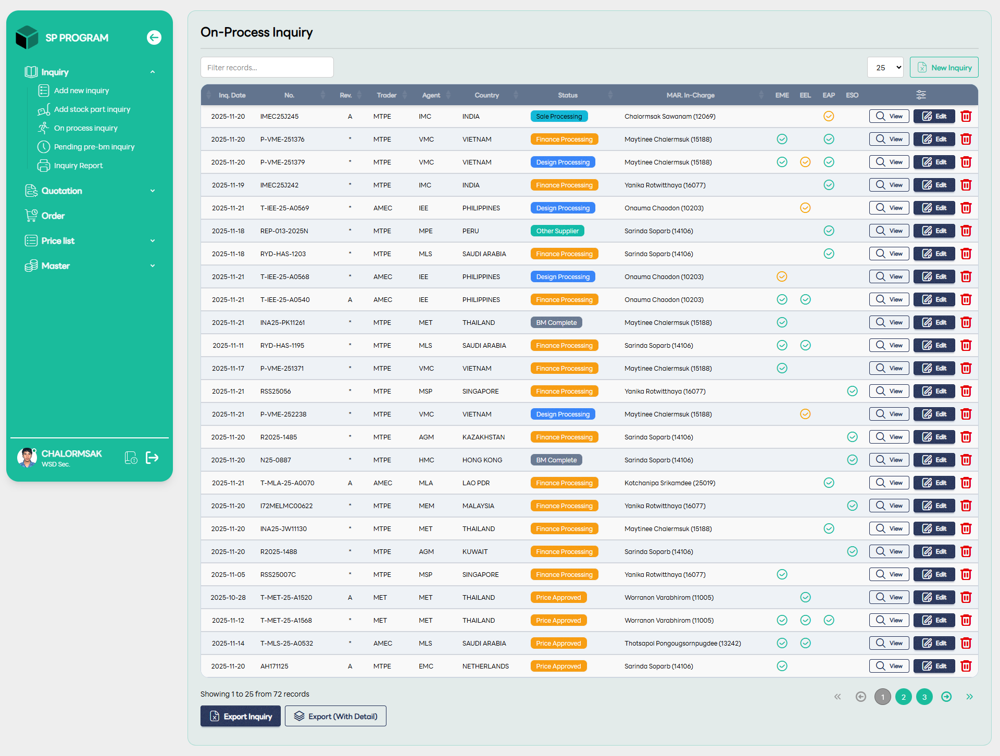

# On-Process inquiry List

::: info 🎯
หน้าจอนี้ทำหน้าที่เป็น Dashboard หลักเพื่อให้ผู้ใช้ติดตามได้ว่าแต่ละ Inquiry อยู่ในขั้นตอนไหน ใครเป็นผู้รับผิดชอบ และมีสถานะปัจจุบันเป็นอย่างไร
:::

## 1. ส่วนควบคุมและค้นหา (Top Controls)

- Filter records: ช่องสำหรับพิมพ์เพื่อค้นหาหรือกรองข้อมูลในตารางแบบ Real-time

- Rows Selector: เมนู Dropdown (ระบุเลข 25) สำหรับเลือกจำนวนรายการที่จะให้แสดงผลต่อหนึ่งหน้า

- New Inquiry Button: ปุ่มลัดสำหรับกดเพื่อสร้างรายการสอบถามใหม่โดยตรงจากหน้านี้

## 2. ตารางแสดงรายการ (Main Inquiry Table)

ตารางนี้รวบรวมข้อมูลสำคัญของทุก Inquiry ไว้ในที่เดียว โดยมีคอลัมน์ที่น่าสนใจดังนี้:

- Status (สถานะ): แสดงขั้นตอนปัจจุบันด้วยแถบสีที่ต่างกันเพื่อให้สังเกตง่าย เช่น:
    - 🔵 Sale Processing: อยู่ระหว่างฝ่ายขายดำเนินการ
    - 🔵 Finance Processing: อยู่ในขั้นตอนของฝ่ายบัญชี/การเงิน
    - 🔵 Design Processing: อยู่ระหว่างการออกแบบ
    - 🔘 BM Complete: ขั้นตอนเตรียมวัสดุ (Bill of Materials) เสร็จสิ้นแล้ว
    - 🔘 Price Approved: ราคาได้รับการอนุมัติเรียบร้อย

- MAR. In-charge: ระบุชื่อพนักงานที่ดูแลรับผิดชอบรายการนั้นๆ

- Checkmarks (EME, EEL, etc.): สัญลักษณ์วงกลมถูกแสดงถึงการผ่านการตรวจสอบหรือการอนุมัติในแต่ละแผนกย่อย

## 3. ปุ่มจัดการรายบรรทัด (Action Icons)

ที่ด้านขวาสุดของทุกรายการจะมีปุ่มคำสั่ง 3 ปุ่มหลัก:

- 🔍 View: สำหรับเข้าไปดูรายละเอียดข้อมูลทั้งหมดของ Inquiry นั้น

- 📝 Edit: สำหรับแก้ไขข้อมูลในกรณีที่สถานะยังอนุญาตให้แก้ไขได้

- 🗑️ Delete (ถังขยะสีแดง): สำหรับลบรายการออกจากระบบ

## 4. ส่วนสรุปและส่งออกข้อมูล (Bottom Footer)

- Record Summary: แสดงจำนวนรายการทั้งหมด (เช่น แสดง 1 ถึง 25 จากทั้งหมด 72 รายการ)

- Pagination: ปุ่มเปลี่ยนหน้า (1, 2, 3...) สำหรับดูรายการในหน้าถัดไป

- Export Buttons:
    - Export Inquiry: ส่งออกข้อมูลสรุปเป็นไฟล์เอกสาร

    - Export (With Detail): ส่งออกข้อมูลแบบละเอียดรวมถึงรายการชิ้นส่วนภายใน
