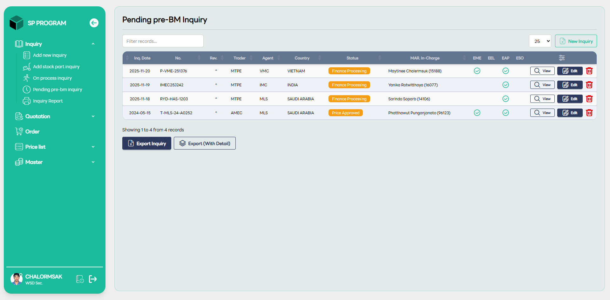

# Pennig Pre-BM Inquiry

::: info 🎯
หน้าจอ "Pending pre-BM Inquiry" เป็นหน้าจอที่ออกแบบมาเพื่อคัดกรอง (Filter) เฉพาะรายการที่อยู่ในขั้นตอนเตรียมข้อมูลเพื่อส่งเข้าสู่ระบบ AS400 สำหรับการคำนวณ BOM (Bill of Materials) และวัสดุโดยเฉพาะ โดยหน้านี้มีโครงสร้างคล้ายกับหน้า On-Process แต่มีวัตถุประสงค์เพื่อเป็น "รายการรอตรวจทาน" ก่อนเข้าสู่กระบวนคิดราคา และส่งใบเสนอราคาไปยังลูกค้า อ่านรายละเอียดเพิ่มเติมได้จาก [On-Process inquiry List](/mar/inquiry-onprocess).
:::

