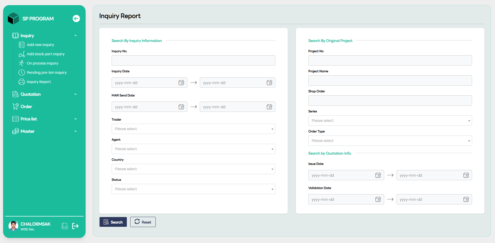
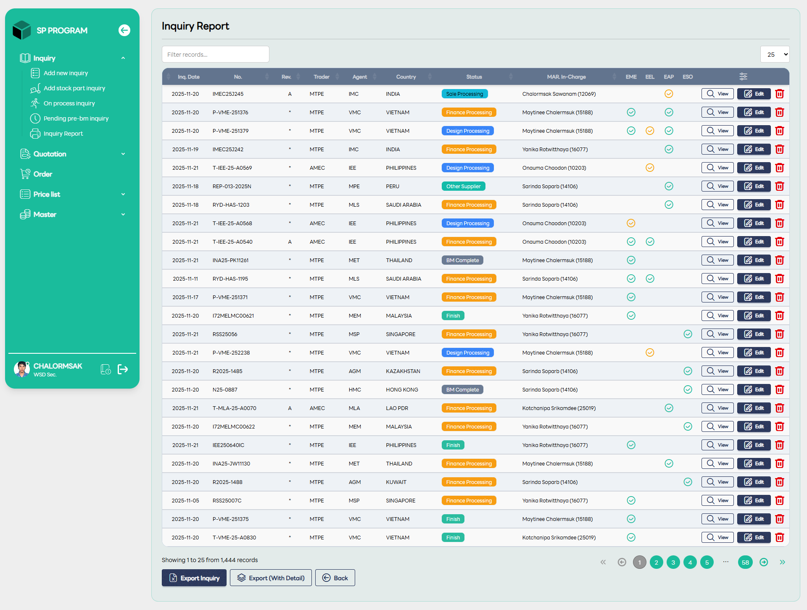

# Inquiry Report

::: info 🎯
หน้ารายงานนี้ออกแบบมาเพื่อให้คุณสามารถตรวจสอบประวัติการทำงานย้อนหลังทั้งหมดของระบบ SP PROGRAM ได้อย่างละเอียด และสามารถส่งออกข้อมูล (Export) ไปใช้งานต่อในรูปแบบไฟล์ Excel เพื่อจัดทำรายงานสรุปประจำเดือนหรือรายโปรเจกต์ได้อย่างรวดเร็ว
:::

หน้าจอในส่วนของ Inquiry Report จะถูกแบ่งออกเป็น 2 ส่วนหลัก คือหน้าสำหรับ ระบุเงื่อนไขการค้นหา (Search Filter) และหน้าสำหรับ แสดงผลลัพธ์ข้อมูล (Report List) เพื่อให้คุณสามารถดึงข้อมูลออกมาวิเคราะห์ได้อย่างแม่นยำ

## 🔍 1. หน้าจอเงื่อนไขการค้นหา (Inquiry Report Search)

หน้านี้เป็นด่านแรกสำหรับการกรองข้อมูลจำนวนมากในระบบ เพื่อเรียกดูเฉพาะรายงานที่คุณต้องการ โดยแบ่งหมวดหมู่การค้นหาดังนี้:

- Search By Inquiry Information: สามารถค้นหาตามเลขที่ Inquiry, ช่วงวันที่สอบถาม (Inquiry Date), วันที่ส่งงาน (MAR Send Date), หรือระบุชื่อ Trader, Agent, ประเทศ และสถานะของงาน

- Search By Original Project: ใช้สำหรับค้นหาตามข้อมูลโปรเจกต์ เช่น เลขที่โปรเจกต์ (Project No), ชื่อโปรเจกต์, Shop Order, หรือเลือกตาม Series และประเภทของ Order

- Search By Quotation Info: กรองข้อมูลตามวันที่ออกใบเสนอราคา (Issue Date) หรือวันที่ตรวจสอบข้อมูล (Validation Date)

### ปุ่มควบคุม

- Search: กดเพื่อเริ่มค้นหาตามเงื่อนไขที่ระบุ

- Reset: ล้างค่าเงื่อนไขที่กรอกไว้ทั้งหมดเพื่อเริ่มใหม่

## 📊 2. หน้าจอแสดงผลลัพธ์รายงาน (Inquiry Report List)

- หลังจากกดค้นหา ระบบจะแสดงรายการทั้งหมดที่ตรงตามเงื่อนไขในรูปแบบตารางสรุปผล ซึ่งประกอบด้วย:

- ตารางข้อมูลสรุป: แสดงรายละเอียดภาพรวมเหมือนหน้า On-Process เช่น เลขที่งาน, ครั้งที่แก้ไข (Rev.), ผู้รับผิดชอบ และสถานะปัจจุบัน

- จุดแตกต่างที่สำคัญ: หน้ารายงานนี้จะรวบรวมข้อมูลทั้งหมดในระบบ ไม่ได้จำกัดเฉพาะงานที่กำลังดำเนินอยู่เหมือนหน้า On-Process

- สถานะ Finish (สีเขียว): ในหน้านี้จะปรากฏรายการที่สถานะเป็น "Finish" หรือเสร็จสมบูรณ์แล้วจำนวนมาก เพื่อใช้สำหรับการดูย้อนหลังหรือทำรายงานสรุป

- เครื่องมือจัดการด้านล่าง
    - Export Inquiry: ดาวน์โหลดไฟล์รายงานสรุปภาพรวม

    - Export (With Detail): ดาวน์โหลดรายงานแบบละเอียดพร้อมรายการชิ้นส่วนภายใน

    - Back: ปุ่มสำหรับย้อนกลับไปหน้ากรอกเงื่อนไขการค้นหา
