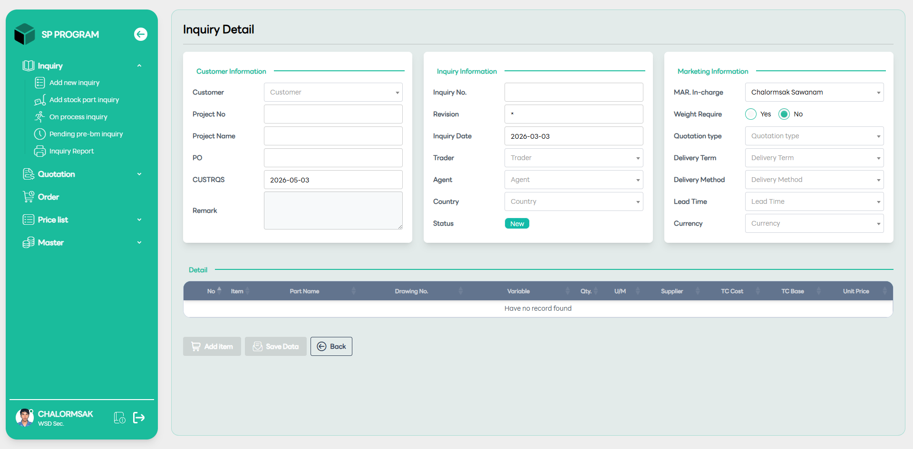

# Create New Inquiry Stock

::: info 🎯
หน้านี้ใช้สำหรับสร้าง "Inquiry ชิ้นส่วนที่มีใน Direct Sale Item Master" โดยมีรายละเอียดส่วนที่เพิ่มมาดังนี้:
:::

## Customer Information (ข้อมูลลูกค้า)

- Customer: เลือกชื่อลูกค้าจากระบบผ่าน Dropdown

- PO: ระบุเลขที่ใบสั่งซื้อจากลูกค้า (ถ้ามี) เพื่อใช้ในการอ้างอิง

- CUSTRQS (Customer Request Date): ระบุวันที่ที่ลูกค้าต้องการข้อมูลหรือต้องการสินค้า

## Detail Table (ตารางราคาสินค้าสต็อก)

ส่วนนี้ถูกออกแบบมาเพื่อแสดงราคาที่ชัดเจน:

- TC Cost: ต้นทุนรวมของชิ้นส่วน

- TC Base: ราคาฐานสำหรับใช้คำนวณ

- Unit Price: ราคาต่อหน่วยที่จะเสนอขายให้กับลูกค้า

## การใช้งานปุ่ม Action

- Add item: คลิกเพื่อเลือกชิ้นส่วนที่มีอยู่ในฐานข้อมูลคลังสินค้า (Master Data) เข้ามาในตาราง

- Save Data: บันทึกข้อมูลการสอบถามชุดนี้ลงในระบบเพื่อเตรียมออกใบเสนอราคา (Quotation) ต่อไป
